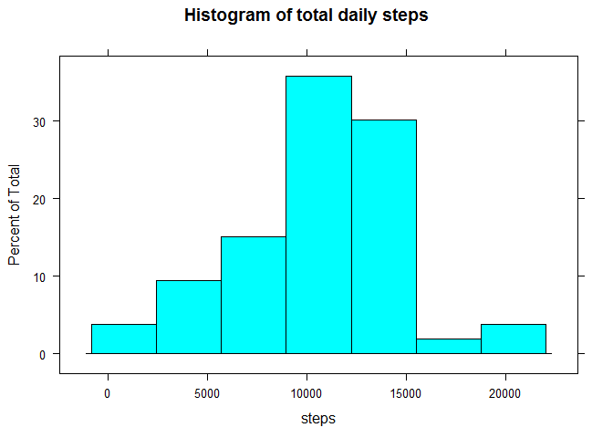
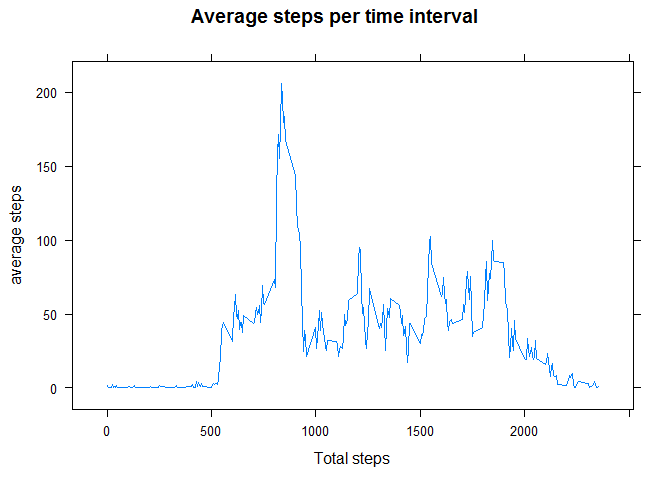
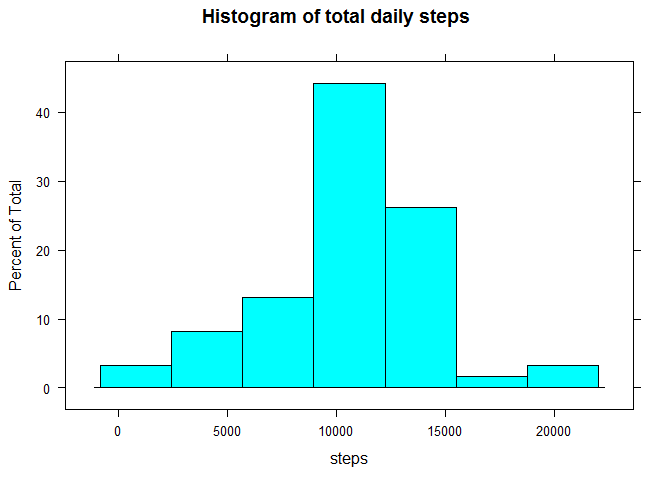
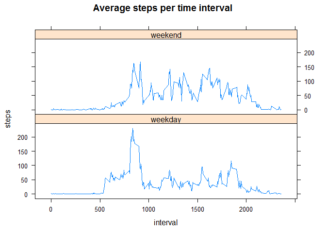

# Reproducible Research: Peer Assessment 1
Tom Tegtmeyer  


## Loading and preprocessing the data

```r
activity <- read.csv(unz("activity.zip", "activity.csv"))
```

## What is mean total number of steps taken per day?


```r
daysum <- aggregate(steps ~ date, data = activity, sum) #aggregate steps by date
library(lattice)
with(daysum, histogram(steps,  main = "Histogram of total daily steps"))
```



What are the mean and median number of total daily steps?

```r
mean(daysum$steps); median(daysum$steps)
```

```
## [1] 10766.19
```

```
## [1] 10765
```

## What is the average daily activity pattern?

```r
intave <- aggregate(steps ~ interval, data = activity, mean) #aggregate steps by interval
with(intave, xyplot(steps ~ interval, type = "l", 
                  xlab = "Total steps", 
                  ylab = "average steps", 
                  main = "Average steps per time interval"))
```



Which time interval has the highest average number of steps? 


```r
mint<-which.max(intave$steps)
intave[mint,]
```

```
##     interval    steps
## 104      835 206.1698
```
It appears the 8:35-8:40 time interval has the highest average number of steps at around 206 steps.

## Imputing missing values
How many missing values are there (missing = "TRUE")?

```r
table(is.na(activity$steps))
```

```
## 
## FALSE  TRUE 
## 15264  2304
```

There are 2304 missing steps values.

We will replace each missing value with the mean for its 5-minute time interval, rounded to the nearest integer.


```r
# The function impute replaces NA steps values with the rounded mean
# for the same time interval (using the intave table from above)

impute <- function (steps, interval) {
        if (!is.na(steps)) steps 
        else round(intave$steps[which(intave$interval==interval)],0)
}

#create new data frame iactivity with imputed values
iactivity<-activity
for (i in 1:nrow(activity)) 
        iactivity$steps[i]<-impute(iactivity$steps[i],iactivity$interval[i])

#find the daily total steps with the imputed values.
idaysum <- aggregate(steps ~ date, data = iactivity, sum)
with(idaysum, histogram(steps,  main = "Histogram of total daily steps"))
```



What are the mean and median values using the imputed data?


```r
mean(idaysum$steps); median(idaysum$steps)
```

```
## [1] 10765.64
```

```
## [1] 10762
```

Note that the mean differs slightly from the earlier mean of 10766.19 steps. This is because the imputed values were rounded to the nearest integer. The median now happens to be the total number of steps for a day of imputed values, as we added 8 days with a total of 10762 steps each to basically the middle of the daily totals.

## Are there differences in activity patterns between weekdays and weekends?

```r
#the weekend function determines whether a date is a weekday or weekend.
weekend <- function (date) {if (weekdays(date) %in% c("Saturday", "Sunday"))
        "weekend"
        else "weekday"
}

#create a new weekend variable (wknd) in the iactivity data frame.
for (i in 1:nrow(iactivity)) {iactivity$wknd[i] <-
        weekend(as.Date(iactivity$date[i]))
}

#make wknd a factor variable 
iactivity$wknd <- as.factor(iactivity$wknd)

#find the mean by interval and wknd factor
iagg<-aggregate(steps ~ interval + wknd, data = iactivity, mean)

xyplot(steps~interval|wknd, data=iagg, type = "l", layout = c(1,2),
       main = "Average steps per time interval")
```



The individual seems to get moving earlier and has a higher peak number of steps on weekdays, but is less active after the peak.
